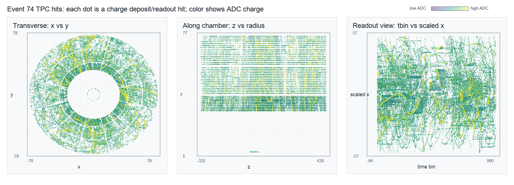

# Event 74 TPC Parameter Guide

This file explains how the columns in `event74_hits.csv` relate to a Time Projection Chamber, or TPC, in a particle-collision experiment.

## Big Picture

A TPC is a 3D detector for charged particles.

After a collision, charged particles pass through gas inside the chamber. As they move, they ionize the gas and leave trails of electrons. An electric field makes those electrons drift toward readout pads. The electronics record where charge arrived, when it arrived, and how much charge was measured.

In this CSV, each row is one TPC hit:

> At this detector layer and angle, at this drift-time bin, the electronics measured this amount of charge.

Those hits together form a sparse 3D picture of the event.

## How The CSV Columns Map To The TPC

| Column | Meaning in the TPC |
|---|---|
| `event` | Collision event ID. In this file, all rows belong to event `74`. |
| `layer` | Radial detector layer or pad row. In the transverse `x-y` view, layers appear as rings at different radii. |
| `phi` | Azimuthal angle around the beam axis. It tells where around the circular detector the hit occurred. |
| `tbin` | Time bin. This is related to electron drift time, so it helps determine position along the drift direction. |
| `adc` | Charge amplitude measured by the readout electronics. Larger `adc` means a stronger signal. |
| `zelem` | Likely a readout-side, z-segment, or detector-region identifier. In this file, `-666` appears to be an invalid or placeholder value. |
| `x` | Reconstructed x-coordinate of the hit. |
| `y` | Reconstructed y-coordinate of the hit. |
| `z` | Reconstructed z-coordinate or drift-coordinate of the hit. |
| `plot_x` | Display coordinate used for plotting. In this file it matches `tbin`. |
| `plot_y` | Display/projection coordinate, usually used to make event displays easier to view. |
| `plot_z` | Display/projection coordinate, usually used to make event displays easier to view. |

## What A Row Represents

Example row:

| event | layer | phi | tbin | adc | zelem | x | y | z |
|---:|---:|---:|---:|---:|---:|---:|---:|---:|
| 74 | 3 | -0.399423 | -8 | 210 | 0 | 7.09161 | -2.99346 | -7.77245 |

Interpretation:

This row says that in event `74`, the TPC recorded a hit on detector layer `3`, at angular position `phi = -0.399423`, with time bin `-8`, and measured charge `adc = 210`. The reconstructed spatial position of that hit is approximately `(x, y, z) = (7.09, -2.99, -7.77)`.

## Why This Looks Like A TPC Event

The `x-y` view shows ring-like structure because the TPC is cylindrical. The `layer` value corresponds to radius: larger layers are farther from the center.

The `z` or drift-coordinate view shows how hits extend along the chamber. This comes from the drift time of ionization electrons.

The `adc` value gives the measured charge. Real tracks often appear as connected paths of nearby hits, while noise or fake signals can appear as isolated, unusually intense, or geometrically inconsistent hits.

## Connection To Fake Signal Detection

An autoencoder can learn the normal structure of TPC events, then flag hits or regions that are hard to reconstruct.

Normal TPC patterns may include:

- Smooth particle tracks across neighboring layers.
- Spatially connected hits in `x`, `y`, and `z`.
- Consistent relationships between `layer`, `phi`, `tbin`, and position.
- Reasonable `adc` distributions along tracks.

Suspicious or fake-like patterns may include:

- Isolated hits far from any track.
- Very high `adc` values in unusual locations.
- Hits with impossible or inconsistent geometry.
- Broken or discontinuous patterns in layer/time space.
- Placeholder or invalid rows mixed into normal training data.

## Important Preprocessing Notes

This event file contains invalid-looking rows:

- Some rows have missing values for `phi`, `tbin`, `x`, `y`, `z`, `plot_x`, `plot_y`, and `plot_z`.
- Some rows use `zelem = -666`, which appears to be a placeholder or invalid detector-region value.

For autoencoder training, these should probably be removed, masked, or treated as a separate category. Otherwise, the model may learn file artifacts instead of real TPC physics.

## Good Feature Choices For An Autoencoder

Depending on the model design, useful inputs could include:

- Physical coordinates: `x`, `y`, `z`
- Detector coordinates: `layer`, `phi`, `tbin`
- Signal amplitude: `adc`
- Optional region indicator: `zelem`, after handling invalid values

Two common ways to represent the event are:

1. Point-cloud representation: each hit is a point with features such as `x`, `y`, `z`, and `adc`.
2. Image/grid representation: bin hits into a 2D or 3D grid, for example `layer` by `tbin`, with pixel intensity based on `adc`.

For fake-signal detection, the best representation depends on whether the fake signals are expected to be isolated bad hits, bad track fragments, or larger detector-pattern artifacts.

## One-Sentence Summary

`event74_hits.csv` is a hit-level snapshot of one TPC collision event: each row records where charge was detected in the chamber, when it arrived, and how strong the signal was.
